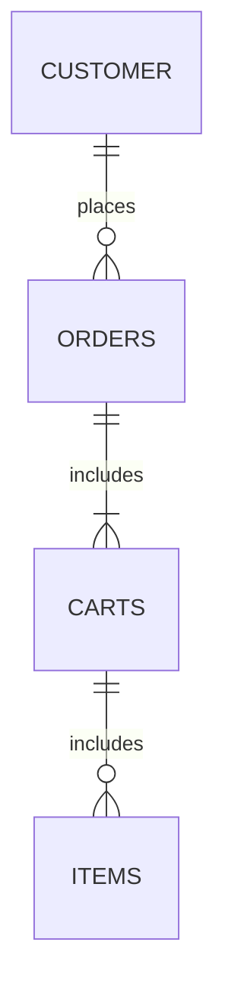

It can be divided into five steps:
1. Identify Participants
2. Identify Activities
3. Break into Steps
4. Create API Definitions
5. Validate API

Example of the process: Ordering a book
1. The customer searches for the book
2. The customer adds the book to their cart.
3. The customer adds or removes more things
4. The customer checks out
5. The stock clerk retrieves and ships the book
6. Customer support contacts the customer about the book

Different view
1. View **items**
2. Add **item** to **cart**
3. Add or remove more items - not relevant
4. Place **order**
5. Ship order - not relevant
6. Cancel order - not relevant

-> finding API resources

API Relationship between resources:
---
* Independent: can exist on its own
* Dependent: can exist only when another resource already exists
* Associative: can be dependent or independent but needs additional information to describe it

API doesn't need to map the database schema!

At this point we have a design and a structure.

Always a good idea to validate early stage by modeling the API on a microframework.

There is a lot of confusion what REST is.
REST is simply a set of principles and constraints. 

Every HTTP request has two parts: header and payload.

curl -I https://api.github.com 
-I: shows more details, like header's content

HTTP Response Codes:
---
1xx 
100 -199 Informational

2xx
... among them 202 is interesting: 
202 - Accepted -> Action started, relevant for quing systems
204 - No content

3xx
301 - moved permanetly
302 - moved temporarily

4xx
400 - Bad Request, client problem
401 - Authentication
403 - Forbidden, permissions issue
404 - Not Found

5xx
Server Error

REST API Constraints
---
1. Cleint-server architecture
2. Stateles architecture
3. Cacheable
4. Layered systems
5. Code on demand
6. Uniform interfaces 

Idempotent or Safe Commands
---
GET, PUT, and DELETE
* The state of resources on the server is exactly the same after repeated comands
* Cashable
POST
* The state of resources on the server may change after repeated commands
* Often not cashable

Authentication and Authorization
---
Authn
* Authentication - who you are
Authz
* Authorization - establish your permissions

API Keys
Benefits
* Easy to add to header or URL
* Framework and programming language agnostic
Drawback
* URLs are not secrets - api key will be logged and cached
* Difficult to update/rotate if compromised

OAuth
Authorization protocol - recommended for API

Media Types
---
1. Collection + JSON
	1.	Designed by Mike Amudsen
	2.	Designed specifically to deal with groups or collection of resources
2. Hypertrext Spplication Language (HAL)
	1. Lead by Mike Kelly
	2. Separates the payload into two parts: data and _links
3. The Ion Hypermedia Type
	1. Designed by Les Hazelwood
	2. Similar to HAl but links are more in cotaxt

