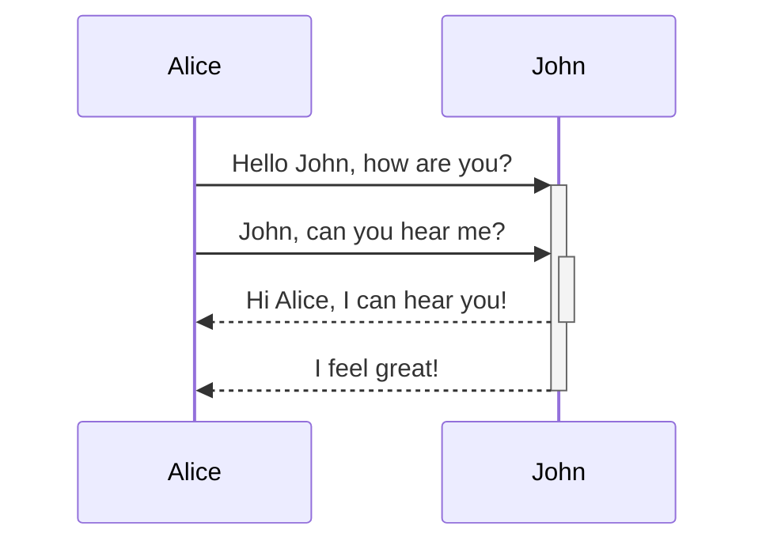

It can be divided into five steps:
1. Identify Participants
2. Identify Activities
3. Break into Steps
4. Create API Definitions
5. Validate API

Example of the process: Ordering a book
1. The customer searches for the book
2. The customer adds the book to their cart.
3. The customer adds or removes more things
4. The customer checks out
5. The stock clerk retrieves and ships the book
6. Customer support contacts the customer about the book

Different view
1. View **items**
2. Add **item** to **cart**
3. Add or remove more items - not relevant
4. Place **order**
5. Ship order - not relevant
6. Cancel order - not relevant

-> finding API resources

